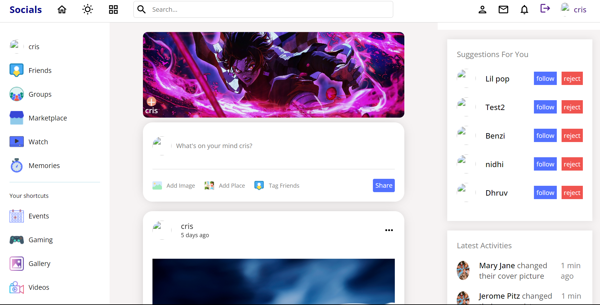
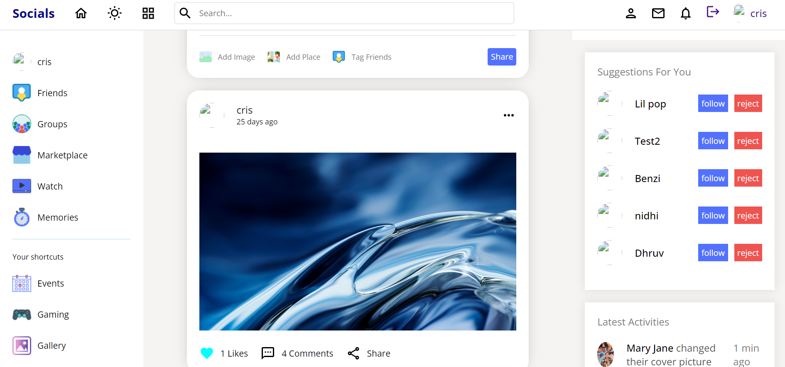
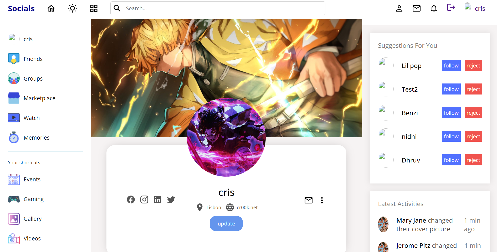
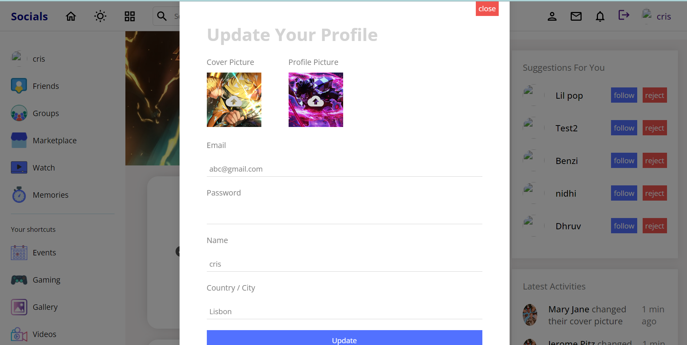
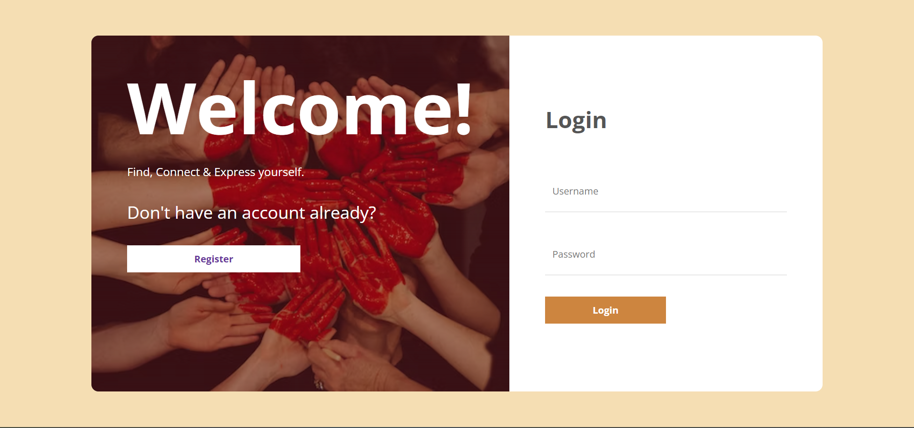

# Social Media App

Welcome to the Social Media App! This application is built with React.js, SCSS, Node.js, Express.js, and MySQL to provide a platform for social interactions.

## Table of Contents

- [Features](#features)
- [Technologies Used](#technologies-used)
- [Screenshots](#screenshots)

## Features

- **User Authentication**: Secure user registration and login.
- **Post Creation and Interaction**: Users can create, edit, and delete posts. Others can like and comment on posts.
- **User Profiles**: Customize user profiles with avatars and additional information.
- **Friendship System**: Connect with other users, view their posts, and manage friends.

## Technologies Used

- **Frontend**:

  - React.js
  - SCSS
  - CSS3

- **Backend**:
  - Node.js
  - Express.js
  - MySQL

## Screenshots

_Home Page_

_Social Media Feed_

_User Profile Page_

_Profile Update_

_Register Page_

_Login Page_
